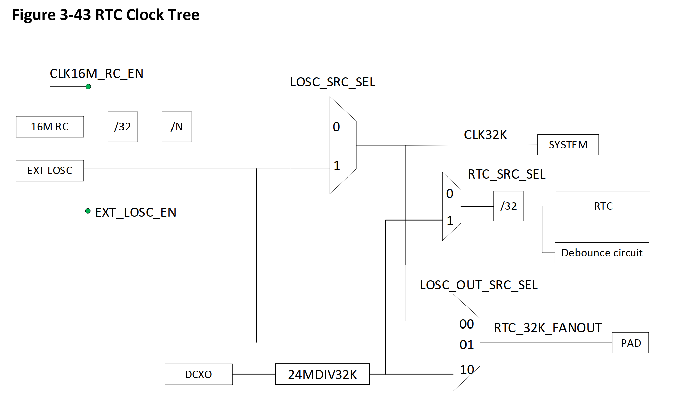
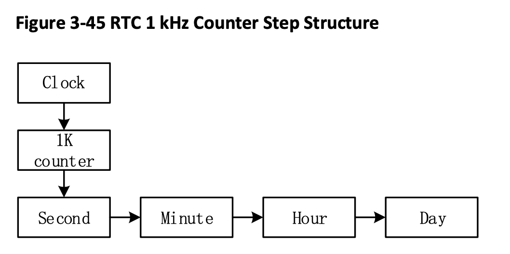
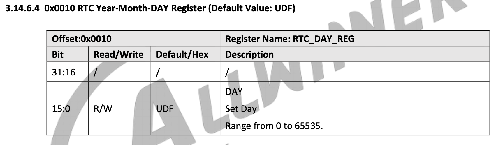
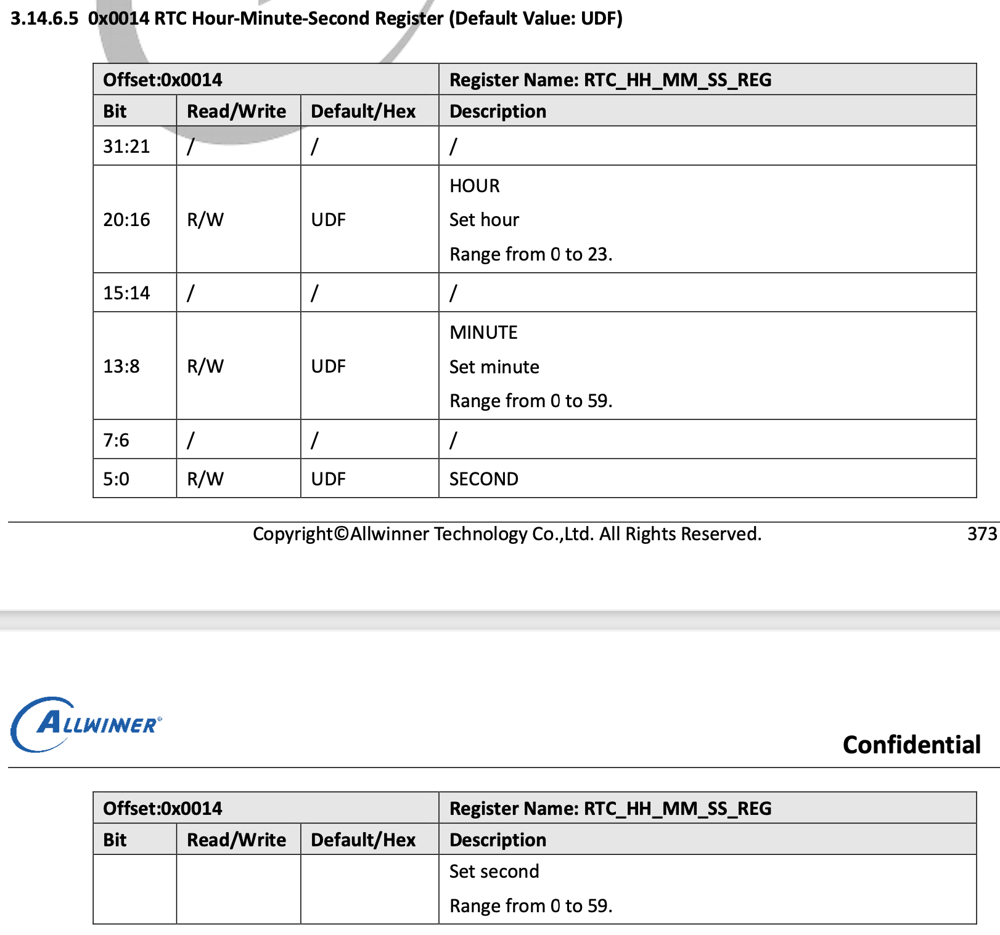
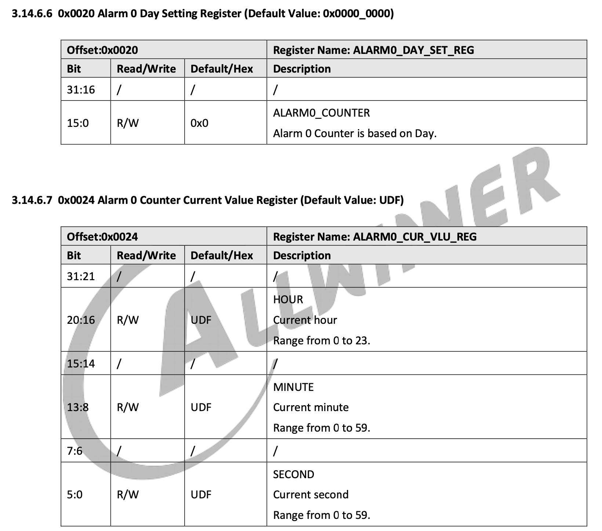
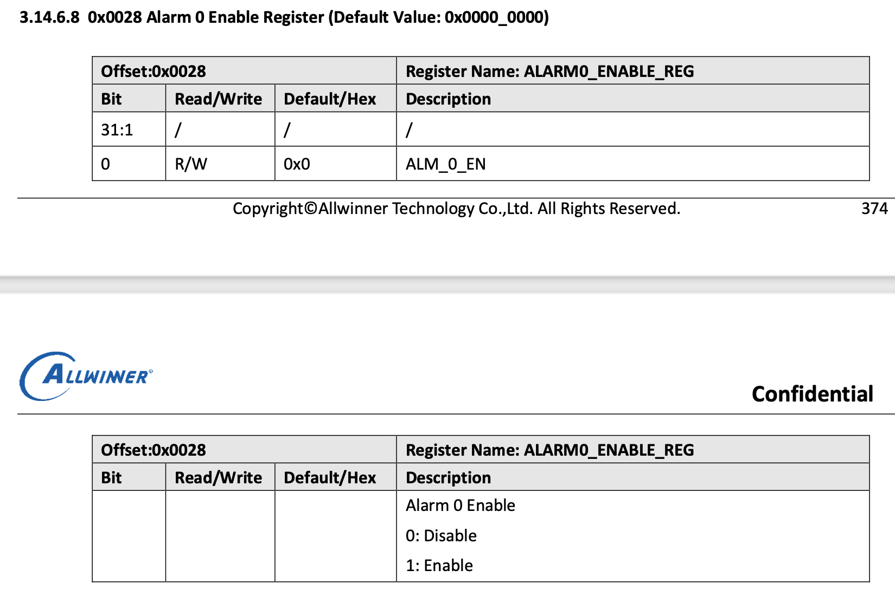
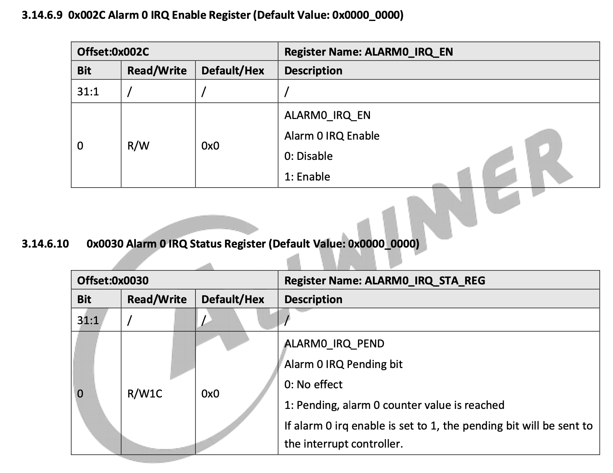
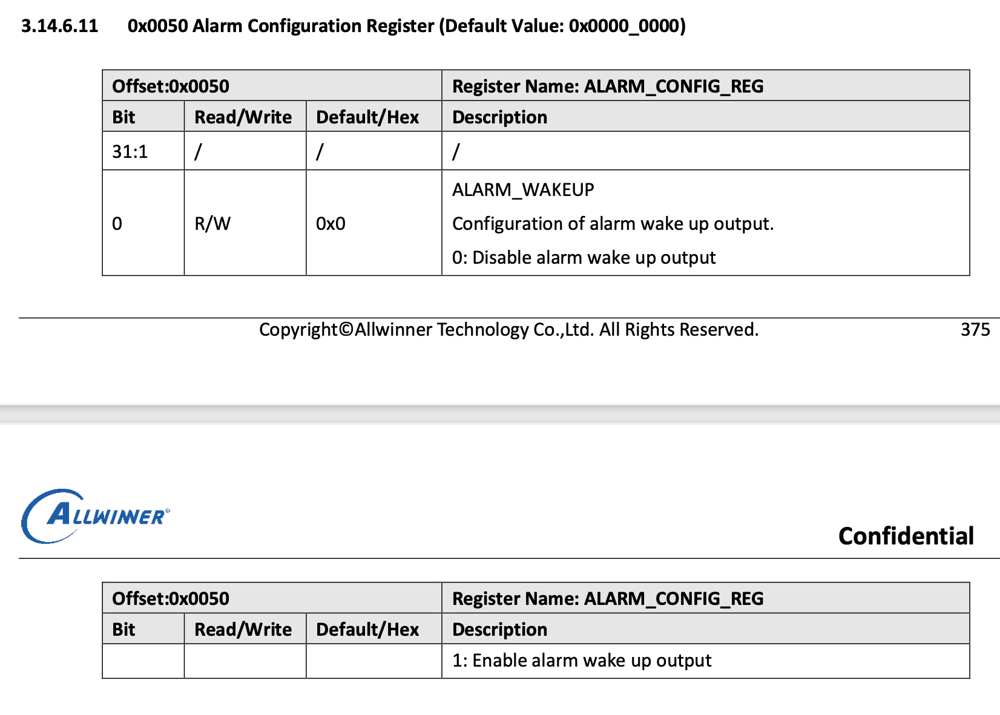

# 驱动全志哪吒 D1 的 RTC

## 介绍

在* D1_User_Manual_V0.1(Draft Version) *中，与 RTC 有关的部分主要是 3.14 节对 RTC 的端口与使用方式的具体说明。因此这篇文章主要还是对文档的翻译与说明，其次是在我们的操作系统中编写符合接口规范的代码。

哪吒 D1 使用了全套全志的 sunxi 硬件设备，RTC 模块被称为 sunxi-rtc。

阅读文档 3.14.1 节，可以了解到这是一个记录日历型时间的 RTC 设备，这与 QEMU 上使用的 Goldfish RTC 所采用的记录 UNIX 时间戳的 RTC 有很大的不同。

> 实时时钟（RTC）用于实现时间计数器和定时唤醒功能。RTC 可以实时显示年、月、日、周、时、分、秒。RTC 有独立的电源在系统断电时继续工作。

> RTC 具有以下功能：
> 
> - 提供用于计日的 16 位计数器，计小时的 5 位计数器，计分钟的 6 位计数器，计秒的 6 位计数器
> - 外部连接一个 32.768 kHz 低频振荡器，用于计时
> - 定时器频率为 1 kHz
> - 随时可通过软件配置初始值
> - 支持定时警报，并生成中断，唤醒外部设备
> - 8 个 32 位用户寄存器，用于存储 关机信息
> 
> **注意：RTC 的寄存器配置是 AHB 总线，它只可以支持按字操作，不可按字节操作和半字操作**

> **小知识**
> 
> D1 的 RTC 时钟树
> 
>  
>  
> LOSC_SRC_SEL:
> 
> LOSC 有 2 个时钟源：内部 RC 与外部低频晶振。启动时默认选择内部 RC，也可通过软件选择外部低频晶振以提供更精确的时钟。LOSC 的时钟精确与外部低频晶振的精确有关。通常选择 32.768 kHz 具有 ±20 ppm 频率公差的晶振。使用内部 RC 时，可以通过更改分频比率（图中`/N`）来更改时钟。使用外部时钟时，无法更改时钟。
> 
> RTC：
> 
> RTC 的时钟源可以通过相关开关选择，包括由内部 16 MHz RC 分频所得的 32K 信号、外部 DCXO 分频所得的 32K 信号与外部 32.768 kHz 晶振产生的信号。随后被图中`/32`分频器分频**得到 1kHz 的输入信号**
> 
> System 32K：
> 
> 系统 32K 的时钟源来自外部 32.768 kHz 晶振信号，或内部 16 MHz 分频出的 32K 信号。
> 
> RTC_32K_FANOUT：
> 
> RTC_32K_FANOUT 的时钟源可以选择 CLK32K（系统 32K 的来源）、外部 32.768 kHz 晶振或外部 DCXO 分频所得的 32k 信号。随后通过引脚直接引出。

### 工作原理

#### 时钟

  

RTC 模块从外部获得 1kHz 的输入源，随后在模块内计数，每计数 1000 次在计秒计数器上加 1，随后按层级依次更新计分计数器、计小时计数器、计日计数器。这些计数器的范围分别为 [0,59]、[0,59]、[0,23]、[0,65535]。

注意：这些计数器没有硬件纠错机制，因此不应该向其中写入不合理的值。

sunxi_rtc 没有年、月计数器，因此需要通过日计数器来计算，但是我们的 RTC 接口设定与读取日期的参数都是时间戳，因此我们设计时不需要考虑年月的计算。

#### 闹钟

闹钟本质上是一个比较器，当时钟达到闹钟设定值时，闹钟就会发出中断信号，或者通过 NMI 引脚输出低级信号唤醒电源管理芯片（可用于定时开机）。

每次中断发生时，需要重设闹钟时间才能继续发出下一次中断。

> **小知识**
> 
> 关机时信息存储：
> 
> RTC 提供 8 个 32 位通用寄存器来存储断电信息。
> 
> 由于 VCC-RTC 冷启动后始终保持非断电状态，因此当系统处于关机或待机状态时，CPU 可以通过存储信息判断软件进程。

## 寄存器数据结构设计

这里的寄存器指的是硬件的**端口**。

寄存器参考 D1 文档第 3.14.5 节寄存器列表与 3.14.6 节寄存器描述，其中我们只需使用从偏移 `0x0000` 开始的 `LOSC_CTRL_REG` 寄存器到 `0x0050` 开始的 `ALARM_CONFIG_REG` 寄存器，其余寄存器多为电器参数控制和其他硬件参数相关的控制，我们用不到，也不需要修改。

和 goldfish_rtc 的设计一样，我们也是用结构体来表示这些寄存器偏移。

阅读 3.14.6 节寄存器描述，会发现我们需要用的寄存器都是 32bit 的，因此可以使用 `uint32_t` 作为各个寄存器变量的类型。但是注意这些寄存器之间是不连续的，因此要在不连续的部分插入占位成员变量，以确保结构体的布局与真实硬件端口地址偏移的布局是相同的。

代码如下：

注：混合使用 `uint32_t` 与 `uint64_t` 可能会因为内存对齐导致编译器自动填充未对齐的部分，如果使用 gcc 编译器，可以使用 `struct __attribute__((__packed__)) sunxi_rtc_regs` 来禁用对齐，这里建议全部使用 `uint32_t` 添加占位成员变量。*（参考 [Structure padding and packing](https://stackoverflow.com/questions/4306186/structure-padding-and-packing) ）*

```c
struct sunxi_rtc_regs {
    uint32_t losc_ctrl_reg; // 0x00, losc control register
    uint32_t losc_auto_swt_sta_reg; // 0x04, losc auto switch status register
    uint32_t intosc_clk_prescal_reg; // 0x08, intosc clock prescaler register
    uint32_t padding1; // 0x0c, padding
    uint32_t rtc_day_reg; // 0x10, rtc day register
    uint32_t rtc_hh_mm_ss_reg; // 0x14, rtc hour, minute, second register
    uint32_t padding2[2]; // 0x18, padding
    uint32_t alarm0_day_set_reg; // 0x20, alarm0 day set register
    uint32_t alarm0_cur_vlu_reg; // 0x24, alarm0 current value register
    uint32_t alarm0_enable_reg; // 0x28, alarm0 enable register
    uint32_t alarm0_irq_en; // 0x2c, alarm0 interrupt enable register
    uint32_t alarm0_irq_sta_reg; // 0x30, alarm0 interrupt status register, Write 1 to clear
    uint32_t padding3[7]; // 0x34, padding
    uint32_t alarm_config_reg; // 0x50, alarm configuration register
};
```

## 程序设计

程序设计参考 D1 文档第 3.14.4 节的指南

### 时间转换

由于 sunxi_rtc 使用了日历型时钟，因此我们需要写两个 UNIX 时间戳与日历型时钟相互转换的函数，这里的原理就略去，直接给出代码：

```c
#define SEC_PER_DAY 86400
#define SEC_PER_HOUR 3600
#define SEC_PER_MIN 60

static void timestamp_to_day_hh_mm_ss(uint64_t timestamp, uint32_t *day,
                                      uint32_t *hh, uint32_t *mm, uint32_t *ss)
{
    timestamp /= 1000000000; // ns -> s
    *day = timestamp / SEC_PER_DAY;
    *hh = timestamp % SEC_PER_DAY / SEC_PER_HOUR;
    *mm = timestamp % SEC_PER_HOUR / SEC_PER_MIN;
    *ss = timestamp % SEC_PER_MIN;
}

static uint64_t day_hh_mm_ss_to_timestamp(uint32_t day, uint32_t hh,
                                          uint32_t mm, uint32_t ss)
{
    uint64_t timestamp =
            day * SEC_PER_DAY + hh * SEC_PER_HOUR + mm * SEC_PER_MIN + ss;
    return timestamp * 1000000000; // s -> ns
}
```

### 时钟源控制

1. 选择时钟源：通过 `LOSC_CTRL_REG` 的位 [0] 选择时钟源，默认时钟源是内部 RC 振荡器。当系统启动时，可以通过软件切换到外部 32K 振荡器。

2. 自动切换：启用 `LOSC_CTRL_REG` 的位 [15:14] 后，RTC 在外部晶体无法输出波形时自动将时钟源切换到内部振荡器，切换状态可以通过 `LOSC_AUTO_SWT_STA_REG` 的位 [1] 查询。

注意：如果仅配置 `LOSC_CTRL_REG` 的位 [15]，则在自动切换生效后无法更改时钟源状态位，因为这两个功能是独立的。

我们不需要时钟源控制功能，所以这一部分仅做了解。

### 时钟控制

1. 写入时间初始值：将当前时间写入 `RTC_DAY_REG` 和 `RTC_HH_MM_SS_REG`。

2. 更新时间后，RTC 重新启动计数。软件可以随时读取当前时间。

注意：在执行设置之前，确保 `LOSC_CTRL_REG` 的位 [8:7] 为 0。

```c
// D1 文档给出的示例伪代码
// For example: set time to 21st, 07:08:09 and read it.
RTC_DAY_REG = 0x00000015;
RTC_HH_MM_SS_REG = 0x00070809; //0000 0000 000|0 0000(Hour) 00|00 0000(Minute) 00|00 0000(Second) 
Read (RTC_DAY_REG);
Read (RTC_HH_MM_SS_REG);
```

其中`RTC_DAY_REG` 和 `RTC_HH_MM_SS_REG` 的布局如下：

  

  

根据文档，写出读写时钟的函数：

```c
uint64_t sunxi_rtc_read_time()
{
    struct sunxi_rtc_regs *regs = (struct sunxi_rtc_regs *)SUNXI_RTC_START_ADDR;
    uint32_t day = regs->rtc_day_reg;
    uint32_t hh_mm_ss = regs->rtc_hh_mm_ss_reg;
    // 根据 3.14.6.4、3.14.6.5 节布局转换天、时、分、秒到时间戳
    return day_hh_mm_ss_to_timestamp(day, hh_mm_ss >> 16,
                                     (hh_mm_ss >> 8) & 0x3f, hh_mm_ss & 0x3f);
}

void sunxi_rtc_set_time(uint64_t now)
{
    uint32_t day;
    uint32_t hh;
    uint32_t mm;
    uint32_t ss;

    struct sunxi_rtc_regs *regs = (struct sunxi_rtc_regs *)SUNXI_RTC_START_ADDR;

    // 转换时间戳到天、时、分、秒
    timestamp_to_day_hh_mm_ss(now, &day, &hh, &mm, &ss);
    // 首先检测 LOSC_CTRL_REG 的位 [8:7] 是否为 0
    if (regs->losc_ctrl_reg & 0x180) {
        // 如果不为 0，报错
        kprintf("LOSC_CTRL_REG[8:7] is not 0, cannot set time\n");
        return;
    } else {
        now >>= 9; // ns -> s
        // 根据 3.14.6.4 节布局修改 RTC_DAY_REG
        regs->rtc_day_reg = (uint64_t)day;
        // 根据 3.14.6.5 节布局修改 RTC_HH_MM_SS_REG
        regs->rtc_hh_mm_ss_reg = hh << 16 | mm << 8 | ss;
    }
}
```

### ALARM0 闹钟控制

1. 通过写 `ALARM0_IRQ_EN` 启用 alram0 中断。

2. 设置时钟比较器：向 `ALARM0_DAY_SET_REG` 与 `ALARM0_HH-MM-SS_SET_REG` （下图中为 `ALARM_CUR_VLE_REG`) 写入闹钟的日、小时、分钟、秒。

3. 写入 `ALARM0_ENABLE_REG` 以启用 alarm 0 功能，然后可以通过 `ALARM0_DAY_SET_REG` 和 `ALARM0_HH-MM-SS_SET_REG` （下图中为 `ALARM_CUR_VLE_REG`) 实时查询闹钟时间。当设置时间达到时，`ALARM0_IRQ_STA_REG` 将被置 1 以生成中断。

4. 在进入中断处理程序后，写入 `ALARM0_IRQ_STA_REG` 以清除中断，并执行中断处理程序。

5. 恢复中断并继续执行被中断的进程。

6. 断电唤醒由 SoC 硬件和 PMIC 生成，程序仅需要设置 alarm 0 的触发条件，并将 `ALARM_CONFIG_REG` 设置为 1 即可。

相关寄存器布局如下：





  

  

```c
// D1 文档给出的示例伪代码
irq_request(GIC_SRC_R_Alarm0, Alm0_handler); irq_enable(GIC_SRC_R_Alarm0);
writel(1, ALARM0_DAY_SET_REG);
writel(1, RTC_HH_MM_SS_REG); //set 1 second corresponding to normal mode; writel(1, ALM0_EN);
writel(1, ALM_CONFIG); //NMI output
while(!readl(ALM0_IRQ_STA));
writel(1, ALM0_IRQ_EN);
while(readl(ALM0_IRQ_STA));
```

根据文档，写出读写闹钟、处理中断以及关闹钟（中断）的函数，注意，`alarm0_irq_sta_reg` 寄存器是 W1C（Write 1 to clear, 写 1 来清零）的，另外 sunxi_rtc 是在从 x 秒跳到 x+1 秒的那一刹那才会触发设置在 x 秒的闹钟，需要在闹钟设置里面提前一秒：

```c
void sunxi_rtc_set_alarm(uint64_t alarm)
{
    uint32_t day;
    uint32_t hh;
    uint32_t mm;
    uint32_t ss;

    struct sunxi_rtc_regs *regs = (struct sunxi_rtc_regs *)SUNXI_RTC_START_ADDR;
    // 通过写 ALARM0_IRQ_EN 启用 alram0 中断。
    regs->alarm0_irq_en = 1;
    // 设置时钟比较器：向 ALARM0_DAY_SET_REG 与 ALARM0_HH-MM-SS_SET_REG 写入闹钟的日、小时、分钟、秒。
    // 转换时间戳到天、时、分、秒
    timestamp_to_day_hh_mm_ss(alarm, &day, &hh, &mm, &ss);
    alarm >>= 9; // ns -> s
    // 根据布局修改 ALARM0_DAY_SET_REG
    regs->alarm0_day_set_reg = (uint64_t)day;
    // 根据布局修改 ALARM0_HH-MM-SS_SET_REG
    regs->alarm0_cur_vlu_reg = hh << 16 | mm << 8 | (ss - 1);
    // 写入 ALARM0_ENABLE_REG 以启用 alarm 0 功能
    regs->alarm0_enable_reg = 1;
}

uint64_t sunxi_rtc_read_alarm()
{
    struct sunxi_rtc_regs *regs = (struct sunxi_rtc_regs *)SUNXI_RTC_START_ADDR;

    // 可以通过 ALARM0_DAY_SET_REG 和 ALARM0_HH-MM-SS_SET_REG （下图中为 ALARM_CUR_VLE_REG) 实时查询闹钟时间。
    uint32_t day = regs->alarm0_day_set_reg;
    uint32_t hh_mm_ss = regs->alarm0_cur_vlu_reg;
    return day_hh_mm_ss_to_timestamp(day, (hh_mm_ss >> 16) & 0x1f,
                                     (hh_mm_ss >> 8) & 0x3f, hh_mm_ss & 0x3f);
}

void sunxi_rtc_interrupt_handler()
{
    struct sunxi_rtc_regs *regs = (struct sunxi_rtc_regs *)SUNXI_RTC_START_ADDR;
    // 在进入中断处理程序后，写入 ALARM0_IRQ_STA_REG 以清除中断，并执行中断处理程序。
    regs->alarm0_irq_sta_reg = 1;
}

void sunxi_rtc_clear_alarm()
{
    struct sunxi_rtc_regs *regs = (struct sunxi_rtc_regs *)SUNXI_RTC_START_ADDR;
    regs->alarm0_irq_en = 0;
    regs->alarm0_irq_sta_reg = 1;
    regs->alarm0_enable_reg = 0;
}
```

### 注册设备

最后和 goldfish_rtc 一样，我们也要将 sunxi_rtc 注册到接口上以便调用。

```c
static const struct rtc_class_ops sunxi_rtc_ops = {
    .read_time = sunxi_rtc_read_time,
    .set_time = sunxi_rtc_set_time,
    .read_alarm = sunxi_rtc_read_alarm,
    .set_alarm = sunxi_rtc_set_alarm,
    .rtc_interrupt_handler = sunxi_rtc_interrupt_handler,
    .clear_alarm = sunxi_rtc_clear_alarm,
};

extern struct rtc_class_device rtc_device;
void sunxi_rtc_init()
{
    rtc_device.ops = sunxi_rtc_ops;
}
```