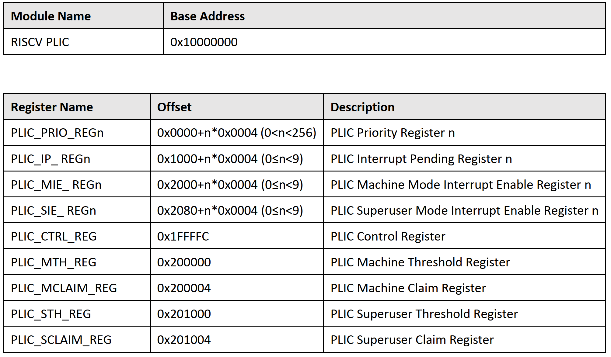

# 驱动全志哪吒 D1 的 PLIC

## 基本介绍

请优先参考 [PLIC 规范](plic.md)，哪吒 D1 的 PLIC 基本是其子集，部分寄存器命名有些许不同，可以通过地址或者描述来判断。（除`PLIC Control Register`外）

以下内容主要参考、摘录自 *D1_User_Manual_V0.1(Draft Version)* 的 3.8 节与*玄铁 C906 R1S0 用户手册*第十章。

> PLIC 仅用于外部中断源的采样，优先级仲裁和分配。
> 
> - 外部中断源采样，优先仲裁和分配
> - 中断可以配置为 M 模式和 S 模式
> - 最多 256 个中断源采样，支持中断优先级和脉冲中断
> - 32 个中断优先级
> - 为每个中断模式（M/S）独立维护中断使能
> - 为每个中断模式（M/S）独立维护中断阈值
> - 可配置 PLIC 寄存器的访问权限

PLIC 寄存器列表如下表所示：

  

`PLIC Priority Register n` 是设置第 n 个中断源优先级的寄存器，可读可写。此处全志的文档表格有误，每个寄存器低 5 位均有效，值范围在 [0,31]。

sunxi_plic 支持 32 种不同的优先级，其中，机器模式中断优先级无条件高于超级用户模式中断。当中断目标模式相同时，优先级 1 为最低优先级，优先级 31 为最高。当多个优先级相同的中断等待仲裁时，进一步比较中断源 ID，ID 较小的有高优先级。

`PLIC Interrupt Pending Register n` 是指示中断是否发生待处理的寄存器。

`PLIC Machine Mode Interrupt Enable Register n` 是指示 M 模式中断使能的寄存器。

`PLIC Superuser Mode Interrupt Enable Register n` 是指示 S 模式中断使能的寄存器。

我们的开发板 D1 只有单核单线程，2 种中断的特权模式，因此有 2 个上下文。虽然只支持最多 256 个中断源，但是由于要和 PLIC 标准所规定的内存布局一致，因此 1 号上下文的使能寄存器组（`PLIC Superuser Mode Interrupt Enable Register n`）的偏移依然需要从 0x2080 开始，下面最后四个寄存器同理。

**注意：此处 PLIC Control Register 与 PLIC 标准不同：**

`PLIC Control Register` 是 PLIC 的访问权限控制寄存器。

最低位为 0 表示只有 M 模式可以访问 PLIC 的所有寄存器，S 模式不能访问`PLIC_CTRL`, `PLIC_PRIO`, `PLIC_IP` 与 `PLIC_IE` 寄存器，只能访问中断阈值寄存器和中断响应、完成寄存器，U 模式不能访问任何 PLIC 寄存器。

最低位为 1 表示 M 模式可以访问 PLIC 的所有寄存器，S 模式不能访问 `PLIC_CTRL` 寄存器，U 模式不能访问任何 PLIC 寄存器。

`PLIC Machine Threshold Register` 是 M 态的阈值寄存器。

`PLIC Machine Claim Register` 是 M 态的响应/完成寄存器。

`PLIC Superuser Threshold Register` 是 S 态的阈值寄存器。

`PLIC Superuser Claim Register` 是 S 态的响应/完成寄存器。
