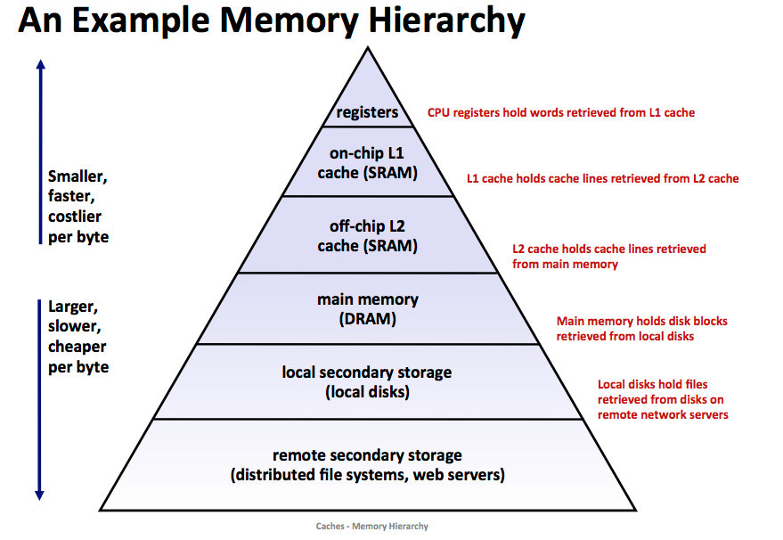

# 总体介绍

## RISC-V

硬件指令集架构千千万，我们选择64位 RISC-V，无他，只是因为这个项目开始时老师推荐使用罢了（笑

先来简单介绍一下 RISC-V，这是一个与 x86 有相当大的区别的开源 RISC 指令集，由加州伯克利和校外的几位大佬共同开发，项目始于2010年，因此是个非常年轻的指令集架构，没有很多的历史包袱，一切从简，并且根据已有的指令集架构的优点和不足做了很多的改进，因此是一个非常“摩登”的指令集架构。它采用模块化设计，64位的 RISC-V 基本指令集称为 **RV64I**（这里的 I 代表整数的意思，即这是一个64位的基本整数指令集），在此基础上可以扩展不同的指令集（如乘法、单双精度浮点的支持等），详细可见 [RISC-V 维基百科](https://zh.wikipedia.org/wiki/RISC-V#%E6%8C%87%E4%BB%A4%E5%AD%90%E9%9B%86)。

RISC-V 作为精简指令集 (reduced instruction set computer，RISC)，有大多数精简指令集架构都有的一大特性：通用寄存器（没有特殊用途可被任意使用的寄存器）非常多。在汇编代码层面与传统 x86 这类复杂指令集 (Complex Instruction Set Computer，CISC) 的汇编语言也有很大的不同，比如没有入栈出栈的汇编语句，当然入栈和出栈的操作还是有的，但这就需要我们使用访存指令和栈指针的寄存器的加减来实现此类操作。具体指令当我们需要用到时会再介绍。

> **小知识：精简指令集计算机 (reduced instruction set computer，RISC)**  
> 
> 精简指令集计算机（英语：reduced instruction set computer，缩写：RISC）或简译为精简指令集，是计算机中央处理器的一种设计模式。这种设计思路可以想像成是一家模块化的组装工厂，对指令数目和寻址方式都做了精简，使其实现更容易，指令并行执行程度更好，编译器的效率更高。目前常见的精简指令集微处理器包括DEC Alpha、ARC、ARM、AVR、MIPS、PA-RISC、Power ISA（包括PowerPC、PowerXCell）、RISC-V和SPARC等。  
> *—— [精简指令集计算机 - 维基百科，自由的百科全书](https://zh.wikipedia.org/wiki/%E7%B2%BE%E7%AE%80%E6%8C%87%E4%BB%A4%E9%9B%86%E8%AE%A1%E7%AE%97%E6%9C%BA)  *
> 
> 指令集的每一条指令的实现都需要花费芯片的一部分面积，精简指令集的一大思想就是只保留最常用的和不可缺少的指令，其余功能通过指令组合来实现，这样指令的译码、执行等所占用的芯片面积较少，在同样的面积下可以比复杂指令集放下更多的通用寄存器（如 RISC-V 有32个通用寄存器）以减少内存访问，加快速度（访问速度：寄存器 > Cache >> 内存）。

&nbsp;

> **存储器层次结构**  
> 
> 
> 
> 存储器从上到下速度降低，价格降低，容量提升。  
> 寄存器是封装在 CPU 核心内部的临时存储器，与 CPU 距离最近，速度最快，容量最小，价格最贵。

RISC-V 处理器通常有 3 个特权级，由高到底分别为 M 模式（machine mode）、S 模式（supervisor mode）和 U 模式（user mode）。M 模式下运行最受信任的代码，S 模式下运行操作系统，U 模式下运行用户程序。M 模式下的代码对整个系统拥有绝对控制权，可以控制一切硬件资源。

## Supervisor 二进制接口（SBI）

RISC-V 标准还规定了一套 **Supervisor 二进制接口（SBI）**，它运行于 M 模式，掌控着整台计算机，你可以认为它是 RISC-V 上的 BIOS（BIOS又可以看作是最底层的直接接触硬件的一个基本操作系统），它提供了一些环境调用的支持，对更底层的硬件做了一部分的抽象和封装。一般来说，操作系统都不会直接管理硬件资源，而是会通过环境调用来让 SBI 协助管理。

> SBI，或者Supervisor Binary Interface，是操作系统向底层（虚拟层、中间件、固件等等）提出服务请求的接口。 从优先级来说，也就是S模式下的程序向M(H)模式的服务程序提出请求的API接口。从软件体系来说，操作系统通过SBI向底层硬件提出服务请求，某种程度上SBI为操作系统提供了针对底层硬件的隔离。
> 
> *—— [CNRV双周简报（2018-12-11）- 技术讨论 - 让我们重新思考SBI的定义](https://cnrv.io/bi-week-rpts/2018-12-11) ( [archive.is互联网存档](https://archive.is/yUxt7) )*（写的不错，建议阅读，了解一下当初讨论的几种思想）  

SBI 只是一个规范，根据这个规范，不同的厂家（或程序员）可以编写不同的 SBI 程序，一个完整的符合 SBI 规范的程序称为 SBI 实现（下面简称 SBI ），RISC-V 官方做了一个 SBI 实现，叫 OpenSBI，此外还有其他的 SBI 实现，如 BBL、RustSBI 等。SBI 是一个刷写在主板上的程序。

> 操作系统作为一个程序，必须加载到内存里才能执行。而“把操作系统加载到内存里”这件事情，不是操作系统自己能做到的，就好像你不能拽着头发把自己拽离地面。
> 
> 因此我们可以想象，在操作系统执行之前，必然有一个其他程序执行，他作为“先锋队”，完成“把操作系统加载到内存“这个工作，然后他功成身退，把CPU的控制权交给操作系统。
> 
> 这个“其他程序”，我们一般称之为 bootloader。很好理解：他负责boot(开机)，还负责load(加载OS到内存里)，所以叫bootloader。
> 
> *—— [内存布局，OpenSBI，elf和bin - ucore step by step](https://1790865014.gitbook.io/ucore-step-by-step/intro-1/1_layout)*

在 RISC-V 中，这个 bootloader 就是 SBI，或者更确切地说，充当 bootloader 就是 SBI 的一部分功能。

计算机的启动顺序：上电 -> 运行 SBI -> SBI 加载运行操作系统 -> 操作系统加载普通用户程序

**如果还是不明白 SBI 是什么，没有关系，具体是什么可能不重要，它能干什么后面也会讲到，不用担心，这并不影响后续的学习。**

## GCC

没错，我们使用 GCC，我们使用 C 语言（虽然GCC已经能编译很多其他语言了），因为大学期间我们学得最早也用得比较熟练的操作系统编程语言就是 C 语言了，其余的底层（可直接控制内存）编程语言如 Rust 语言在大学课程里出现比较罕见，自学的学习曲线也比较陡峭（就是说很难入门），因此我们还是选择比较传统且“落后”的 C 语言。

这里我们使用的 GCC 不是一般的 GCC，而是可以在 x86 架构下编译出 RISC-V 代码的交叉编译器。

> **交叉编译**  
> 
> 在解释什么是交叉编译之前，先要明白什么是本地编译。
> 
> 本地编译可以理解为，在当前编译平台下，编译出来的程序只能放到当前平台下运行。平时我们常见的软件开发，都是属于本地编译：  
> 比如，我们在 x86 平台上，编写程序并编译成可执行程序。这种方式下，我们使用 x86 平台上的工具，开发针对 x86 平台本身的可执行程序，这个编译过程称为本地编译。
> 
> 交叉编译可以理解为，在当前编译平台下，编译出来的程序能运行在体系结构不同的另一种目标平台上，但是编译平台本身却不能运行该程序：  
> 比如，我们在 x86 平台上，编写程序并编译成能运行在 ARM 平台的程序，编译得到的程序在 x86 平台上是不能运行的，必须放到 ARM 平台上才能运行。
> 
> 之所以要有交叉编译，主要**原因**是：
> 
> Speed： 目标平台的运行速度往往比主机慢得多，许多专用的嵌入式硬件被设计为低成本和低功耗，没有太高的性能  
> Capability： 整个编译过程是非常消耗资源的，嵌入式系统往往没有足够的内存或磁盘空间  
> Availability： 即使目标平台资源很充足，可以本地编译，但是第一个在目标平台上运行的本地编译器总需要通过交叉编译获得  
> Flexibility： 一个完整的Linux编译环境需要很多支持包，交叉编译使我们不需要花时间将各种支持包移植到目标板上  
> *—— [什么是交叉编译_whatday的专栏](https://blog.csdn.net/whatday/article/details/73930604)*

&nbsp;

> **小知识：GCC**
> 
> GNU编译器套装（英语：GNU Compiler Collection，缩写为GCC），指一套编程语言编译器，是GNU工具链的主要组成部分之一。GCC（特别是其中的C语言编译器）也常被认为是跨平台编译器的事实标准。
> 
> 原名为GNU C语言编译器（GNU C Compiler），因为它原本只能处理C语言。GCC在发布后很快地得到扩展，变得可处理C++。之后也变得可处理Fortran、Pascal、Objective-C、Java、Ada，Go与其他语言。
> 
> 许多操作系统，包括许多类Unix系统，如Linux及BSD家族都采用GCC作为标准编译器。
> 
> *—— [GCC - 维基百科，自由的百科全书](https://zh.wikipedia.org/wiki/GCC)*

## GDB

既然用了 GCC，那就用配套的调试平台 GDB 吧，没有什么其他的原因。

> **小知识：GDB**  
> 
> GNU调试器（英语：GNU Debugger，缩写：GDB），是GNU软件系统中的标准调试器，此外GDB也是个具有移携性的调试器，经过移携需求的调修与重新编译，如今许多的类UNIX操作系统上都可以使用GDB，而现有GDB所能支持调试的编程语言有C、C++、Pascal以及FORTRAN。
> 
> *—— [GNU调试器 - 维基百科，自由的百科全书](https://zh.wikipedia.org/wiki/GNU%E4%BE%A6%E9%94%99%E5%99%A8)*

&nbsp;

> **小知识：GNU工具链**
> 
> GNU工具链（英语：GNU toolchain）是一个包含了由GNU计划所产生的各种编程工具的集合，由自由软件基金会负责维护工作。这些工具形成了一条工具链，用于开发应用程序和操作系统。
> 
> 组成（加粗部分是我们会使用到的）：  
> **GNU make**：用于编译和构建的自动工具  
> **GNU编译器集合（GCC）**：一组多种编程语言的编译器  
> **GNU Binutils**：包含链接器、汇编器和其它工具的工具集  
> GNU Bison: 编译器编译程序，经常和 Flex词法分析器 配合使用  
> GNU m4： m4 宏预处理器  
> **GNU Debugger（GDB）**：代码调试工具  
> GNU构建系统（autotools）
> 
> —— [GNU工具链 - 维基百科，自由的百科全书](https://zh.wikipedia.org/wiki/GNU%E5%B7%A5%E5%85%B7%E9%93%BE)

## QEMU

QEMU 是一个很棒的模拟器，可以通过动态的二进制转换，模拟CPU，因此能够让我们在 x86 的电脑上模拟出 RISC-V 的运行环境，便于我们的开发测试，还可以和 GDB 联动调试，非常方便。我们的系统很小很简单，因此也完全不需要考虑性能之类的问题，只要能跑起来就可以了。

此外，QEMU 还内置了 OpenSBI，在我们编译好的可以模拟 64 位 RISC-V 的 QEMU 5.1 中内置的是 OpenSBI v0.7，指令集支持到了 RV64ACDFIMSU。

RV64ACDFIMSU：

- 原子指令(A)
- 压缩指令(C)
- 双精度浮点运算(D)
- 单精度浮点运算(F)
- 整数运算(RV64I)
- 整数乘除法(M)
- 特权级
  - M 模式（machine mode）
  - S 模式（supervisor mode）
  - U 模式（user mode）

## 参考资料

理解 SBI：

- [riscv-sbi-doc](https://github.com/riscv/riscv-sbi-doc/blob/master/riscv-sbi.adoc): SBI 规范。后续我们会封装其中一部分 ecall 调用（环境调用）。

理解 RISC-V 指令集和汇编语言：

- [RISC-V Assembly Language](https://github.com/riscv/riscv-asm-manual/blob/master/riscv-asm.md)：RISC-V 官方的汇编语言教程。篇幅很短，都是例子，需要有 RISC-V 指令的基础。
- [RISC-V Reader（中译版）](http://crva.ict.ac.cn/documents/RISC-V-Reader-Chinese-v2p1.pdf)：完整的 RISC-V 教程，包括主要的指令集拓展和汇编语言。该书假设读者有计算机组成原理、体系结构的知识，了解至少一种指令集，有使用汇编语言编程的经验。
- 《计算机组成与设计-硬件/软件接口（原书第 5 版）》：RISC-V 的两位主要设计者撰写的教材。第二章介绍 RISC-V 指令，并使用 RISC-V 指令编程。该书假设读者没有任何关于计算机组成原理和汇编语言的知识。
