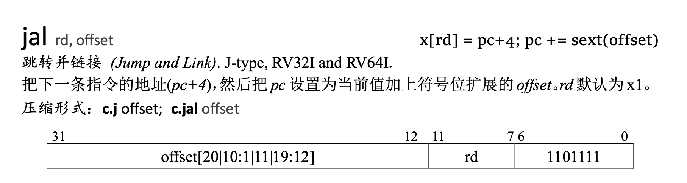

# 虚拟分页的初始化过程

## 我们的任务

内存管理的一切少不了操作系统的参与，其中最重要的任务之一便是维护每个进程的页表，这也包括内核进程的页表。

在我们创建用户进程之前，只有从开机便一直持续运行的内核进程，因此我们需要先为它做一个页表，随后将一级页表的物理地址和分页方案写入 `stap` 寄存器，然后刷新 TLB，虚拟分页就开启成功了。

## 虚拟内存布局规划

在开启分页之前，我们先来规划虚拟内存布局，来决定我们的内核应该放在虚拟内存的的哪一段地址。考虑这样一个前提：虚拟内存的作用之一就是让进程认为自己独占了整了内存，除此之外为了便于调用系统函数，内核部分也需要在虚拟内存地址空间中有所体现，因此虚拟内存的布局中只有系统内核和当前进程的代码与数据。*[RISC-V Reader Chinese v2.1](reference/RISC-V-Reader-Chinese-v2p1.pdf)* 第 50 页的图 3.10 展示了一个典型的 RISC-V 程序分配给代码和数据的内存区域，我们就参考这个布局，在虚拟内存后部加上供存放内核的位置即可，最后我们采用的布局如下：

```
0xFFFFFFFF----->+--------------+
                |              |
                |    Kernel    |
                |              |
0xC0000000----->---------------+
                |    Hole      |
0xBFFFFFF0----->---------------+
                |    Stack     |
                |      +       |
                |      |       |
                |      v       |
                |              |
                |      ^       |
                |      |       |
                |      +       |
                | Dynamic data |
       brk----->+--------------+
                |              |
                | Static data  |
                |              |
                +--------------+
                |              |
                |     Text     |
                |              |
0x00010000----->---------------+
                |   Reserved   |
0x00000000----->+--------------+
```

栈从 `0xBFFFFFF0` 向低地址扩张， `0xC0000000` 正好是栈空间往上最近的与 1 GiB 对齐的起始地址（因为下面我们要使用页面大小为 1 GiB 的大页模式），这样留给内核的空间就会比较大。

内核占据虚拟地址空间的 `0xC0000000` 到 `0xFFFFFFFF` ，可用的物理内存空间是 `0x80000000` 到 `0x88000000` ，内核的起始物理地址和虚拟物理地址恰好相差 `0x40000000` ，得到虚拟地址和物理地址之间的转换关系：

$$VirtualAddress = PhysicalAddress + LinearOffset$$

内核虚拟地址空间就是可用物理内存地址空间的线性映射：

$$
VirtualAddressSpace[0xC0000000,C8000000) \longrightarrow PhysicalAddressSpace[0x80000000, 88000000)
$$

为了便于后续程序编写，我们先来编写一段宏来表示线性映射：

```c
// include/mm.h
#define LINEAR_OFFSET    0x40000000
#define PHYSICAL(vaddr)  (vaddr - LINEAR_OFFSET)
#define VIRTUAL(paddr)   (paddr + LINEAR_OFFSET)
```

最开始，内核程序入口点在 `0x80200000`，转换为虚拟地址后变成 `0xC0200000`。我们需要在链接脚本中写入这个地址，以便编译出来后各符号的内存地址是 `0xC0200000`：

```linker.ld
/* 目标架构 */
OUTPUT_ARCH(riscv)
/* 执行入口 */
ENTRY(_start)
/* 起始地址 */
BASE_ADDRESS = 0xc0200000;
```

这样，可执行文件中的地址全部大于 `0xC0200000`，我们确保了可执行文件中的地址与规定的虚拟地址空间一致。

这时候可能会有疑惑，为什么如此一来 sbi 启动到 `0x80200000` 还可以正确执行呢？

因为我们在启动 QEMU 时参数 `addr=0x80200000` 将内核的代码确确实实地加载到了物理内存的 `0x80200000`，并且在内核启动后到分页开启前的过程中使用的都是相对寻址，没有用到绝对地址的寻址，只要偏移正确，程序自然就能在当前 pc 的基础上向前或向后继续执行。而当前 pc 是在 `0x8020****` 这一段上，未开启分页时所有的地址都是物理地址，而物理地址的这一部分存放的也确实是内核初始化代码，所以不会有问题。

## 开启大页模式虚拟内存

### 写入页表

设计分页方案时有一个问题，我们内核的代码编译后已经远大于 4KiB（一页）了，即使现在没有，以后也会发生，如果让我们手动往内存里一行一行写一整个内核的页表的话，既费时且没有灵活性，每次内核大小的增长都将导致页表需要重新编写。因此我们需要灵活简便的页表生成方式，这里我们采取一种策略：进入内核后让内核自己生成自己的页表。

这有两种实现的方式：

- 先使用 1GiB 的大页模式来映射整个物理内存到虚拟内存，随后开启分页，就进入了虚拟内存的世界，然后系统逐一生成小页表后再重写 `stap` 寄存器，刷新 TLB。
- 进入系统后直接在使用物理地址环境下生成小页表，将一级页表写入 `stap` 寄存器，刷新 TLB。

这里我们采用第一种方案，相对的比较灵活自由，第二种方案由同学们自己考虑可行性与实现方法。

### 开启分页

开启分页并不难，只需要将页表地址和分页方案写入 `stap` 寄存器即可，在那之前，我们还得构造一个页表，[回顾一下上一节 Sv39 的页表项结构](intro.html#sv39)，按照上面所讲的内容，我们构造一个这样的线性映射：

$$
VirtualAddressSpace[0xC0000000,C8000000) \longrightarrow PhysicalAddressSpace[0x80000000, 88000000)
$$


那么 PTE 中每一项需要填的就是

- Reserved: 0000 0000 00b
- PPN[2]: 0x8000 0000h >> (12 + 9 + 9)
- PPN[1]: 0 0000 0000b（随意填）
- PPN[0]: 0 0000 0000b（随意填）
- RSW: 00b（随意填）
- D: 0b
- A: 0b
- G: 0b（随意填）
- U: 0b
- X: 1b
- W: 1b
- R: 1b
- V: 1b

组合起来用算术表示就是 $((0x80000000 >> 30) << 28) | 0x0F$，即$(0x80000000 >> 2) | 0x0F$

虚拟内存是 `0xC0000000`，向右移动 12 + 9 * 2 = 30 位可得 3，表示此条页表项应该放在一级页表下标为 3 的位置（即第 4 条），需要在这条映射之前放 3 条无效（V = 0）的页表项。页表项每条占 64 bits，即 8 Bytes，我们使用汇编伪操作 `.zero 3 * 8` 来实现， `.zero N` 表示填充 N 个字节的 0，当一条页表项全为 0，那么 V 位一定是 0，可以很方便实现无效页表项的填充。

每个页表有 512 项，因此后面还有 508 条无效页表项需要填充，同样使用 `.zero 508 * 8` 完成。

页表就这么建完了。.. 吗？

显然没有，考虑一下当我们建完页表，填写完 `stap` 寄存器开启虚存之后，我们的 `pc` 在哪？没错，`pc` 仍然停留在 `0x8020****` 这一段，但我们已经开始用页表了，这一虚拟地址的对应项在页表里是无效的（V = 0），因此继续执行的话，从 `pc` 所指虚拟地址取指会出现错误，我们还需建一条页表项，让虚拟地址 `0x80000000` 映射到物理地址 `0x80000000` 处。

模仿上面的算法，我们要在页表第 3 条同样写入 `.quad (0x80000000 >> 2) | 0x0F`，因此最后页表在 `entry.S` 中是这样的：

```assembly
boot_pg_dir:
    .zero 2 * 8
    .quad (0x80000000 >> 2) | 0x0F
    .zero 508 * 8
```

> 为什么我把这个映射删了，代码还是可以运行？因为 QEMU 有指令缓存，实际上这样的删去的写法是错误的。尝试在 `sfence.vma` 后加入指令 `fence.i` 即可发现运行失败。

在构建好页表之后，我们就可以把页表加载到 `stap` 寄存器中，这样我们就可以在虚拟地址 `0xC0000000` 处执行 `pc` 指向的指令了。

我们再来回顾一下 `stap` 寄存器的结构：


低 44 位是一级页表的物理页号（物理地址 << 12），中间 16 位是我们暂时不用的 ASID，高 4 位是分页方案（Sv39 对应 8），因此我们需要构造一个寄存器存放 $boot\_pg\_dir << 12 | 8 << (44 + 16)$，随后赋值给 `satp`，最后刷新 TLB 即可，代码如下：

```assembly
_start:
    la t0, boot_pg_dir
    srli t0, t0, 12
    li t1, (8 << 60)
    or t0, t0, t1
    csrw satp, t0
    sfence.vma
```

### 设置栈顶指针并进入 `main` 函数
虚拟分页开启成功了，接下来再设置栈顶指针，随后跳转到我们写的 `main` 函数即可，也许会觉得沿用前面实验的代码无需修改，然而不是这样的。

前面的代码使用短短两行

```assembly
    la sp, boot_stack_top
    call main
```

就实现了。但是当我们如此写上之后会发现最后无法完全正确执行，为什么呢？我们使用 `riscv64-unknown-elf-objdump -d kernel.bin >> disassembly.s` 把生成的 `kernel.bin` 文件反汇编一下，可以看到我们的 `_start` 是由如下汇编代码构成的：

```assembly
00000000c0200000 <_start>:
    c0200000:	00004297          	auipc	t0,0x4
    c0200004:	00028293          	mv	t0,t0
    c0200008:	00c2d293          	srli	t0,t0,0xc
    c020000c:	fff0031b          	addiw	t1,zero,-1
    c0200010:	137e                	slli	t1,t1,0x3f
    c0200012:	0062e2b3          	or	t0,t0,t1
    c0200016:	18029073          	csrw	satp,t0
    c020001a:	12000073          	sfence.vma
    c020001e:	0000e117          	auipc	sp,0xe
    c0200022:	fe210113          	addi	sp,sp,-30 # c020e000 <mem_map>
    c0200026:	004000ef          	jal	ra,c020002a <main>
```

上面两行代码在汇编器汇编后会生成如下代码：

```assembly
    c020001e:	0000e117          	auipc	sp,0xe
    c0200022:	fe210113          	addi	sp,sp,-30 # c020e000 <mem_map>
    c0200026:	004000ef          	jal	ra,c020002a <main>
```

实际上，汇编器见到 `la` 后会算出 `boot_stack_top` 与当前 `pc` 的偏移，随后生成 `auipc` 与 `addi` 的组合指令，指令的功能就是把这个偏移加上 `pc` 后赋值给目标寄存器（此处为 `sp`）。

那么这个偏移是怎么算的呢？汇编器看到符号表，知道 `boot_stack_top` 在内存中的地址是 `0xc020e000`，当前这行指令地址应该是 `0xc020001e`，这样就可以算出偏移了，这个偏移是 `0xc020e000 - 0xc020001e`，也就是 `0xe000 - 0x1e`，拆成两部分组合成了 `auipc` 与 `addi` 的组合指令（我们确实能在上面的反汇编代码中看到 `0xe` 与 `0x1e` 的十进制 30），通过它们加上 `pc` 赋值给 `sp`。

但是等等，汇编器认为当前这行指令地址应该是 `0xc020001e`，而实际上在开启分页后，`pc` 依然保留在 `0x8020001e`，这就导致 `pc` 加上偏移之后，`sp` 变成了 `0x8020e000`，这与虚存地址差了 `0x40000000`。因此，我们需要手动加上 `0x40000000`，这样就可以把 `sp` 变成 `0xc020e000`，这才符合栈在虚存中的位置。

跳转到 `main` 函数也是同理，这里就不再赘述。注意不要被反汇编得到的 `jal	ra,c020002a <main>` 欺骗了以为是跳转到 `0xc020002a`，实际上将指令码 `004000ef` 和 *[RISC-V Reader Chinese v2.1](/reference/RISC-V-Reader-Chinese-v2p1.pdf)* 对照一下就能发现实际上是 `pc += 4`，你会发现似乎能正确进入 `main` 函数，但是不能执行完所有代码，想想原因？可能是后面长跳转时记录的返回地址还是 `0x8020****` ，导致返回出错，也可能是长跳转的目标地址本身就错了，总之 `main` 函数的跳转还是要加上 `0x40000000` 的偏移。

  

最终我们写出来的正确代码是这样的：

```assembly
    li t1, 0x40000000
    la sp, boot_stack_top
    add sp, sp, t1
    la t0, main
    add t0, t0, t1
    jr t0
```

整个 `entry.s` 加上标签与其余的伪代码，完整代码就是

```assembly
    .globl boot_stack, boot_stack_top, _start, boot_pg_dir
    .section .text.entry

# 本项目所用代码模型为 medany, 该代码模型下编译器生成的代码以 PC 相对寻址的方式访问任意地址，地址通过 auipc 和 addi 指令获取。
# 可执行文件中的地址与加载后的内存地址相差 0x40000000，因此处理器访问到的地址加 0x40000000 才是可执行文件中符号的地址。

_start:
    la t0, boot_pg_dir
    srli t0, t0, 12
    li t1, (8 << 60)
    or t0, t0, t1
    csrw satp, t0
    sfence.vma

    li t1, 0x40000000
    la sp, boot_stack_top
    add sp, sp, t1
    la t0, main
    add t0, t0, t1
    jr t0

    .section .bss
boot_stack:
    .space 4096 * 8
boot_stack_top:

    .section .data
boot_pg_dir:
    .zero 2 * 8
    .quad (0x80000000 >> 2) | 0x0F
    .zero 508 * 8
```

> 前面提到，全局变量、函数的地址在编译时已经确定，我们这里取到的地址的值应该与 readelf 读取到的地址完全一样，但实际上并非如此。符号的地址是固定的，取地址的方式却有多种，取决于编译使用的*代码模型*和编译选项。
> 
> 假设程序中有一个变量`global`，地址是 1000，编译器生成访问`global`的代码时有多种选择：
> 
> - 硬编码地址：直接将地址 1000 写死到程序中
> - PC 相对寻址：将`global`地址到访问它的指令地址的差值 Offset 写入程序中，通过 PC + Offset 获取地址 1000,
> - 位置无关代码：将`global`的地址存放到某个固定的地址中，访问时加载器查找`global`的地址并将其写入，程序从这个地址取出（通常是 PC 相对寻址）`global`的地址，再读写`global`。
> 
> 位置无关代码一般用于*动态链接*的可执行文件，某些 Linux 发行版上的 GCC 在编译时加入了特定的参数，总是生成*位置无关可执行文件*，为了确保所有的地址都通过 PC-relative 寻址获取。本内核使用 medany 代码模型，并使用 -fno-pie 禁止生成位置无关可执行文件。

## 从大页到小页

### 我们的新任务

`main` 函数的代码沿用上一个实验的代码不变，但是 `mem_init()` 函数和 `mem_test()` 函数肯定需要有所变化。

在 `mem_init()` 初始化完物理内存的管理之后，我们就需要开始建立 Sv39 的三级页表，即进入小页模式。整体的规划就是先分配一个空闲物理页，随后把它作为一级页表，建立二、三级页表，建立内核部分虚拟内存到物理内存的完整映射，最后激活新的页表即可。

我们先设置一个全局变量 `pg_dir` 指向当前页目录（一级页表）的虚拟地址，并且赋值指向先前建立的大页页表，之后所有和页表有关的函数，都通过 `pg_dir` 来处理页表。

因此我们可以写出如下代码框架：

```c
/* 进入 main() 时开启了 RV39 大页模式，暂时创造一个虚拟地址到物理地址的映射让程序跑起来。
* 现在，我们要新建一个页目录并开启页大小为 4K 的 RV39 分页。*/
uint64_t page = get_free_page();
assert(page, "mem_init(): fail to allocate page");
pg_dir = (uint64_t *)VIRTUAL(page);
map_kernel();
active_mapping();
```

有了这样一个框架，我们要做的自然就是补全其中的函数。上面的 `get_free_page()` 函数是上一个实验所讲内容，不再赘述。

### 建立内核的内存映射

在这里我们需要完善 `map_kernel()` 函数，映射内核物理内存有两个部分需要考虑：

- 真实的内存所在地址空间
  - 物理地址空间：`[MEM_START, MEM_END)`
  - 虚拟地址起始处：`KERNEL_ADDRESS`
  - 标志位：为方便内核访问，设为可读可写可执行且有效 `KERN_RWX | PAGE_VALID`
- 设备 MMIO 地址空间
  - 物理地址空间：`[DEVICE_START, DEVICE_END)`
  - 虚拟地址起始处：`DEVICE_ADDRESS`
  - 标志位：可读可写且有效 `KERN_RW | PAGE_VALID`

我们用函数 `map_pages()` 来完成：

```c
/**
 * @brief 建立所有进程共有的内核映射
 *
 * 所有进程发生系统调用、中断、异常后都会进入到内核态，因此所有进程的虚拟地址空间
 * 都要包含内核的部分。
 *
 * 本函数仅创建映射，不会修改 mem_map[] 引用计数
 */
void map_kernel()
{
    map_pages(DEVICE_START, DEVICE_END, DEVICE_ADDRESS, KERN_RW | PAGE_VALID);
    map_pages(MEM_START, MEM_END, KERNEL_ADDRESS, KERN_RWX | PAGE_VALID);
}
```

随后便是实现 `map_pages()` 函数，使用循环从物理地址空间从头循环到尾，利用 `put_page()` 对地址空间内的每一页，都将其物理地址映射到虚拟地址上，即创建页表，填写对应的页表项：

```c
/**
 * @brief 将物理地址区域映射到虚拟地址区域
 *
 * @param paddr_start 起始物理地址
 * @param paddr_end 结束物理地址
 * @param vaddr 起始虚拟地址
 * @param flag PTE 标志位
 * @note
 *      - 地址必须按页对齐
 *      - 仅建立映射，不修改物理页引用计数
 */
static inline void map_pages(uint64_t paddr_start, uint64_t paddr_end, uint64_t vaddr, uint8_t flag)
{
    while (paddr_start < paddr_end) {
        put_page(paddr_start, vaddr, flag);
        paddr_start += PAGE_SIZE;
        vaddr += PAGE_SIZE;
    }
}
```

在层层封装之后，我们终于来到最内层，要实现 `put_page()` 函数了。函数创建映射的过程就是遍历页表，若页表不存在就创建，直到最后一级页表，将物理页号和标志位写进 PTE。

1. 在映射之前我们首先要判定物理地址是否按页对齐
   - 即某物理地址是否能作为一页的开始，不按页对齐无法使用页表项来表示映射。
2. 根据虚拟地址空间起始地址获取三级虚页号。
3. 从页目录开始，以虚页号为索引，查询在第一、第二级页表中对应的页表项是否有效（不存在即为 0）。若无效，则申请一页空闲物理页用于存放下一级页表，并将其物理地址写入页表项，将有效位置位。随后根据当前页表项进入下一级页表，重复 3
4. 将第三级页表的页表项的物理地址域设置为待映射的物理地址，标志位设置为给定标志位
5. 返回完成映射的物理地址（这一返回值暂未被使用，为以后预留）

注意：第三步中，根据当前页表项进入下一级页表时，需要将页表项中的物理页号扩展到完整物理地址并转成虚拟地址，因为虽然 CPU 的 MMU（内存处理单元）每次读取下一级页表地址时将其视作物理地址，但是我们这里是人工访问这一地址，并未借助 MMU 自动处理页表的机制，且整个系统已经开启了虚拟分页，所有访问的地址都是按照虚拟地址处理，所以将其转为虚拟地址后才能访问到正确位置。

代码如下，其中 `tmp >> 2` 是 `tmp >> 12 << 10` 的缩写，原因请参考 [页表项](intro.md#sv39) 的格式，`page >> 2` 同：

```c
/**
 * @brief 建立物理地址和虚拟地址间的映射
 *
 * 本函数仅仅建立映射，不修改物理页引用计数
 * 当分配物理页失败（创建页表）时 panic，因此不需要检测返回值。
 *
 * @param page   物理地址
 * @param addr   虚拟地址
 * @param flag   标志位
 * @return 物理地址 page
 * @see panic(), map_kernel()
 */
uint64_t put_page(uint64_t page, uint64_t addr, uint8_t flag)
{
    assert((page & (PAGE_SIZE - 1)) == 0,
           "put_page(): Try to put unaligned page %p to %p", page, addr);
    uint64_t vpns[3] = { GET_VPN1(addr), GET_VPN2(addr), GET_VPN3(addr) };
    uint64_t *page_table = pg_dir;
    for (size_t level = 0; level < 2; ++level) {
        uint64_t idx = vpns[level];
        if (!(page_table[idx] & PAGE_VALID)) {
            uint64_t tmp;
            assert(tmp = get_free_page(),
                   "put_page(): Memory exhausts");
            page_table[idx] = (tmp >> 2) | PAGE_VALID;
        }
        page_table =
            (uint64_t *)VIRTUAL(GET_PAGE_ADDR(page_table[idx]));
    }
    page_table[vpns[2]] = (page >> 2) | flag;
    return page;
}
```

### 激活新页表

激活新页表就很简单了，我们要做的就是重新填写 `stap` 寄存器并刷新 TLB，具体代码可以参考 `entray.s` 中的写法与 lab1 中内联汇编的写法。

不过在这里，我们也顺便置位 status 寄存器 SUM 标志位，允许内核读写用户态内存，为之后的用户态进程创建做准备。

我们给了内核读写用户态内存的特权，这样做可能会导致一定的安全问题，但方便了应用态和内核态之间的数据传送。

至此，我们从物理地址过渡到了虚拟地址。

```c
/**
 * @brief 激活当前进程页表
 * @note 置位 status 寄存器 SUM 标志位，允许内核读写用户态内存
 */
void active_mapping()
{
	__asm__ __volatile__("csrs sstatus, %0\n\t"
			     "csrw satp, %1\n\t"
			     "sfence.vma\n\t"
			     : /* empty output list */
			     : "r"(1 << 18),
			       "r"((PHYSICAL((uint64_t)pg_dir) >> 12) |
				   ((uint64_t)8 << 60)));
}
```
