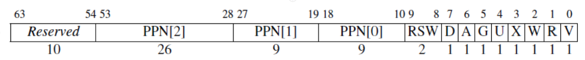

# 虚拟分页的初始化过程

## 我们的任务

内存管理的一切少不了操作系统的参与，其中最重要的任务之一便是维护每个进程的页表，这也包括内核进程的页表。

在我们创建用户进程之前，只有从开机便一直持续运行的内核进程，因此我们需要先为它做一个页表，随后将一级页表的物理地址和分页方案写入 `stap` 寄存器，然后刷新 TLB，虚拟分页就开启成功了。

## 虚拟内存布局规划

在开启分页之前，我们先来规划虚拟内存布局，来决定我们的内核应该放在虚拟内存的的哪一段地址。考虑这样一个前提：虚拟内存的作用之一就是让进程认为自己独占了整了内存，除此之外为了便于调用系统函数，内核部分也需要在虚拟内存地址空间中有所体现，因此虚拟内存的布局中只有系统内核和当前进程的代码与数据。*[RISC-V Reader Chinese v2.1](reference/RISC-V-Reader-Chinese-v2p1.pdf)* 第 50 页的图 3.10 展示了一个典型的 RISC-V 程序分配给代码和数据的内存区域，我们就参考这个布局，在虚拟内存后部加上供存放内核的位置即可，最后我们采用的布局如下：

```
0xFFFFFFFF----->+--------------+
                |              |
                |    Kernel    |
                |              |
0xC0000000----->---------------+
                |    Hole      |
0xBFFFFFF0----->---------------+
                |    Stack     |
                |      +       |
                |      |       |
                |      v       |
                |              |
                |      ^       |
                |      |       |
                |      +       |
                | Dynamic data |
       brk----->+--------------+
                |              |
                | Static data  |
                |              |
                +--------------+
                |              |
                |     Text     |
                |              |
0x00010000----->---------------+
                |   Reserved   |
0x00000000----->+--------------+
```

栈从 `0xBFFFFFF0` 向低地址扩张， `0xC0000000` 正好是栈空间往上最近的与 1 GiB 对齐的起始地址（因为下面我们要使用页面大小为 1 GiB 的大页模式），这样留给内核的空间就会比较大。

内核占据虚拟地址空间的 `0xC0000000` 到 `0xFFFFFFFF` ，可用的物理内存空间是 `0x80000000` 到 `0x88000000` ，内核的起始物理地址和虚拟物理地址恰好相差 `0x40000000` ，得到虚拟地址和物理地址之间的转换关系：

$$VirtualAddress = PhysicalAddress + LinearOffset$$

内核虚拟地址空间就是可用物理内存地址空间的线性映射：

$$
VirtualAddressSpace[0xC0000000,C8000000) \longrightarrow PhysicalAddressSpace[0x80000000, 88000000)
$$

为了便于后续程序编写，我们先来编写一段宏来表示线性映射：

```c
// include/mm.h
#define LINEAR_OFFSET    0x40000000
#define PHYSICAL(vaddr)  (vaddr - LINEAR_OFFSET)
#define VIRTUAL(paddr)   (paddr + LINEAR_OFFSET)
```

最开始，内核程序入口点在 `0x80200000`，转换为虚拟地址后变成 `0xC0200000`。我们需要在链接脚本中写入这个地址，以便编译出来后各符号的内存地址是 `0xC0200000`：

```linker.ld
/* 目标架构 */
OUTPUT_ARCH(riscv)
/* 执行入口 */
ENTRY(_start)
/* 起始地址 */
BASE_ADDRESS = 0xc0200000;
```

这样，可执行文件中的地址全部大于 `0xC0200000`，我们确保了可执行文件中的地址与规定的虚拟地址空间一致。

这时候可能会有疑惑，为什么如此一来 sbi 启动到 `0x80200000` 还可以正确执行呢？

因为我们在启动 QEMU 时参数 `addr=0x80200000` 将内核的代码确确实实地加载到了物理内存的 `0x80200000`，并且在内核启动后到分页开启前的过程中使用的都是相对寻址，没有用到绝对地址的寻址，只要偏移正确，程序自然就能在当前 pc 的基础上向前或向后继续执行。而当前 pc 是在 `0x8020****` 这一段上，未开启分页时所有的地址都是物理地址，而物理地址的这一部分存放的也确实是内核初始化代码，所以不会有问题。

## 写入页表

设计分页方案时有一个问题，我们内核的代码编译后已经远大于 4KiB（一页）了，即使现在没有，以后也会发生，如果让我们手动往内存里一行一行写一整个内核的页表的话，既费时且没有灵活性，每次内核大小的增长都将导致页表需要重新编写。因此我们需要灵活简便的页表生成方式，这里我们采取一种策略：进入内核后让内核自己生成自己的页表。

这有两种实现的方式：

- 先使用 1GiB 的大页模式来映射整个物理内存到虚拟内存，随后开启分页，就进入了虚拟内存的世界，然后系统逐一生成小页表后再重写 `stap` 寄存器，刷新 TLB。
- 进入系统后直接在使用物理地址环境下生成小页表，将一级页表写入 `stap` 寄存器，刷新 TLB。

这里我们采用第一种方案，相对的比较灵活自由，第二种方案由同学们自己考虑可行性与实现方法。

## 开启分页

开启分页并不难，只需要将页表地址和分页方案写入 `stap` 寄存器即可，在那之前，我们还得构造一个页表，[回顾一下上一节 Sv39 的页表项结构](intro.html#sv39)，按照上面所讲的内容，我们构造一个这样的线性映射：

$$
VirtualAddressSpace[0xC0000000,C8000000) \longrightarrow PhysicalAddressSpace[0x80000000, 88000000)
$$



那么 PTE 中每一项需要填的就是

- Reserved: 0000 0000 00b
- PPN[2]: 0x8000 0000h >> (12 + 9 + 9)
- PPN[1]: 0 0000 0000b（随意填）
- PPN[0]: 0 0000 0000b（随意填）
- RSW: 00b（随意填）
- D: 0b
- A: 0b
- G: 0b（随意填）
- U: 0b
- X: 1b
- W: 1b
- R: 1b
- V: 1b

组合起来用算术表示就是 $((0x80000000 >> 30) << 28) | 0x0F$，即$(0x80000000 >> 2) | 0x0F$

虚拟内存是 `0xC0000000`，向右移动 12 + 9 * 2 = 30 位可得 3，表示此条页表项应该放在一级页表下标为 3 的位置（即第 4 条），需要在这条映射之前放 3 条无效（V = 0）的页表项。页表项每条占 64 bits，即 8 Bytes，我们使用汇编伪操作 `.zero 3 * 8` 来实现， `.zero N` 表示填充 N 个字节的 0，当一条页表项全为 0，那么 V 位一定是 0，可以很方便实现无效页表项的填充。

每个页表有512项，因此后面还有508条无效页表项需要填充，同样使用 `.zero 508 * 8` 完成。

页表就这么建完了...吗？

显然没有，考虑一下当我们建完页表，填写完 `stap` 寄存器开启虚存之后，我们的 `pc` 在哪？没错，`pc` 仍然停留在 `0x8020****` 这一段，但我们已经开始用页表了，这一虚拟地址的对应项在页表里是无效的（V = 0），因此继续执行的话，从 `pc` 所指虚拟地址取指会出现错误，我们还需建一条页表项，让虚拟地址 `0x80000000` 映射到物理地址 `0x80000000` 处。

模仿上面的算法，我们要在页表第3条同样写入 `.quad (0x80000000 >> 2) | 0x0F`，因此最后页表在 `entry.S` 中是这样的：

```assembly
boot_pg_dir:
    .zero 2 * 8
    .quad (0x80000000 >> 2) | 0x0F
    .quad (0x80000000 >> 2) | 0x0F
    .zero 508 * 8
```

> 为什么我把这个映射删了，代码还是可以运行？因为 QEMU 有指令缓存，实际上这样的删去的写法是错误的。尝试在 `sfence.vma` 后加入指令 `fence.i` 即可发现运行失败。


```assembly
_start:
    la t0, boot_pg_dir
    srli t0, t0, 12
    li t1, (8 << 60)
    or t0, t0, t1
    csrw satp, t0
    sfence.vma

    li t1, 0x40000000
    la sp, boot_stack_top
    add sp, sp, t1
    la t0, main
    add t0, t0, t1
    jalr x0, 0(t0)
```
