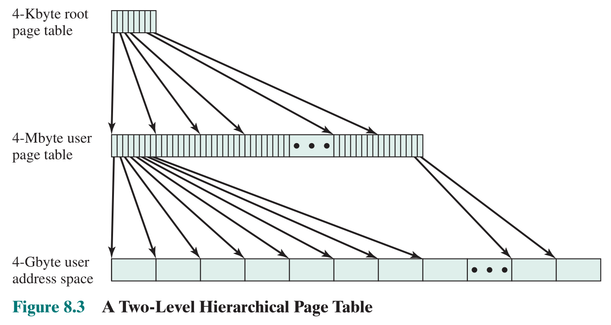
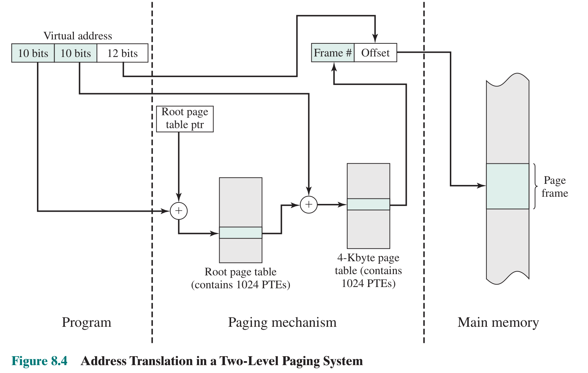
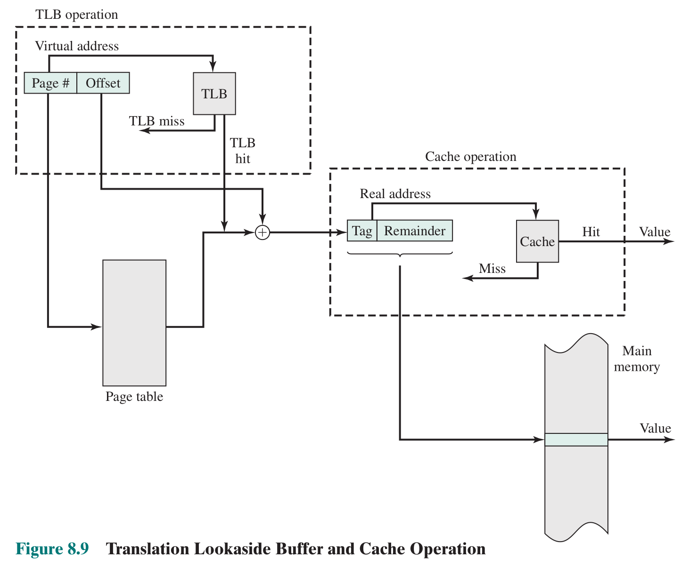
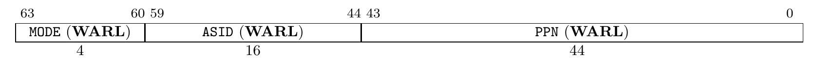
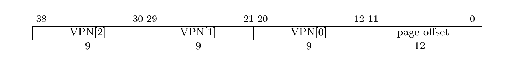
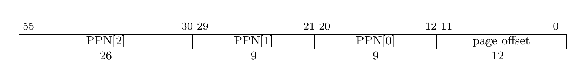
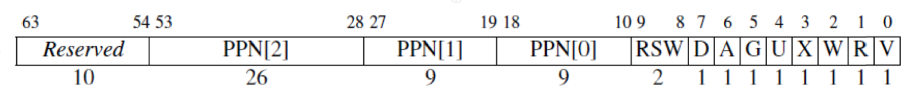

# 什么是虚拟内存

直到现在，我们的内核不受限制地跑在 CPU 上，可以直接访问任何一处物理地址。这时假如内核加载并运行用户程序，用户程序可以几乎无限制的读写物理内存。对于恶意程序，它可以杀死其它程序甚至可以杀死内核，将整个系统的资源据为己有；对于遵纪守法的程序，它必须小心翼翼地控制自己，避免无意中修改了其他程序。显然，这种无限制的环境既给了程序自由，又让程序处于随时可能被破坏的境地。

现代操作系统一般都实现了虚拟内存，程序跑在虚拟内存上，不直接访问物理内存，并且每个程序（进程）都有相同的地址空间。应用程序不需要再担心被别的程序破坏或者不小心写了别的程序的内存，也不再需要考虑自己在内存中的哪个位置。

尽管程序跑在虚拟内存上，但是最终一定是访问到物理内存，虚拟内存只是操作系统的抽象。每当程序访问某个虚拟地址，硬件和操作系统会将虚拟地址转化为某个物理地址，然后程序访问到对应的物理内存。显然，实现虚拟内存的关键就在于**设置虚拟地址到物理地址的映射**。

考虑这样的情况，程序 A 访问虚拟地址 100，程序 B 也访问虚拟地址 100。对于程序 A，操作系统将虚拟地址 100 映射到物理地址 1000；对于程序 B，操作系统将物理地址映射到物理地址 2000。虽然两程序访问同一地址，但最终却访问到物理内存的不同位置。按照这种思路，让不同的程序拥有相同的虚拟地址空间，将其中的虚拟地址映射到不同的物理地址，这样就实现了“每个进程都有相同的地址空间”的抽象。相同虚拟地址可以映射到不同的物理地址，同样的，不同的虚拟地址也可以映射到同一物理地址，这样就实现了不同程序共享同一块内存。

经过以上讨论，相信同学们已经理解了实现虚拟内存的思路。虚拟内存需要软硬件协作才能够高效实现，并且硬件提供的机制制约着操作系统的实现方式，接下来介绍 RISC-V 提供的虚拟内存机制。

# RISC-V 中的虚拟内存管理硬件基础

一个相对完整的 RISC-V 处理器通常会带有一个 MMU（内存管理单元）来处理和内存管理相关的事务，虚拟地址到物理地址的转换就由它来实现。RV64 的标准中给出了若干虚拟内存分页方案，以 SvX 的模式命名，其中 X 是以位为单位的虚拟地址的长度，其中最受欢迎的是 Sv39, QEMU 和阿里平头哥的玄铁 RISC-V 芯片都支持这种分页方案，因此我们也采用这种分页方案。

> 注：玄铁 RISC-V 芯片在官方标准的基础上做了些许修改，将不常用到的字段挪作它用，而 QEMU 中 `virt` 型的虚拟机则与官方标准相同，**我们这里采用官方方案在 QEMU 中实现**，如果后期有想做全志 D1 开发版移植的同学请注意修改代码。

启用分页的时候，大多数地址（包括 load 和 store 的有效地址和 PC 中的地址）都是虚拟地址。要访问物理内存，MMU 将读取页表并将物理地址转换为真正的物理地址。

单级页表是一个以页表项为元素的数组，页表项中除了存有对应虚拟地址所指向的物理地址外，还存有读写权限等附加信息。

现代处理器提供的分页机制基本都使用多级页表，将虚拟地址划分多个虚拟页号（*VPN*, *Virtual Page Numer*）和页内偏移（*offset*），RISC-V 的页内偏移均使用 **12 位**二进制表示（这意味着每一页都是 4KiB）。上一级页表中的页表项（*PTE*， *Page Table Entry*）指向下一级页表的起始物理地址，最后一级页表中页表项指向虚拟地址对应的物理地址。将页表看作页表项数组 `struct pte page_table[]`，某一级 VPN 就是该级页表项数组的索引。以下是查询页表获取物理地址的步骤：

1. 找到一级页表（页目录）的物理地址，这个地址存放在**控制寄存器 satp** 中
2. 根据 VPN 找到包含下级页表起始物理地址的页表项
3. 重复步骤 2，直到查找到最后一级页表
4. 读取页表项中的物理地址

其中，页表中的叶节点指示虚地址是否已经被映射到了真正的物理页面，如果是，则指示了哪些权限模式和通过哪种类型的访问可以操作这个页。访问未被映射的页或访问权限不足会导致页错误异常（page fault exception）。

这里附上一个二级页表的直观结构与地址转换示意图：

复习一下组成原理：

每次访问内存都要查找页表，查找页表要涉及多次内存访问操作，这会严重影响 CPU 读取指令和读写数据的性能。为了解决这个问题，现代处理器使用了 *TLB*（*Translation-Lookaside Buffer*）来加快虚拟地址到物理地址的转换。TLB 是缓存虚拟地址到物理地址映射关系的*全相连高速缓存*，可以看作一个数组，元素存储映射关系。访问内存时，先从 TLB 中查找物理地址，如果查找到（TLB hit），就不需要查找页表，避免的耗时的内存访问；如果没查找到（TLB miss），再查找页表并将映射缓存进 TLB。良好的程序都会重复利用*局部性原理*，并且现代处理器还将指令和数据划分开，分别使用独立的 TLB，取指令用 iTLB，读写数据用 dTLB，还可能存在共用的 uTLB，显著提高地址转换的性能。

本内核不对 TLB 进行细粒度的管理，不介绍 TLB 词条的结构。

当页表与 TLB、Cache 配合时的工作流程如下：

分页管理中，每个进程都有自己独立的虚拟地址空间，为了避免进程切换后通过 TLB 访问到上一进程的映射，将虚拟地址转换为错误的物理地址，通常发生进程切换时要刷新 TLB（清除 TLB 缓存）。

# satp 寄存器

上面提到，一级页表（页目录）的物理地址存放在**控制寄存器 satp** 中，它的格式如下：

其中，MODE 表示分页模式，0 表示不采用分页管理（通常 M 模式的程序在第一次进入 S 模式之前会写 0 以禁用分页），没有地址翻译与保护，8 表示采用 Sv39 分页方案。

*ASID*（*Address Space IDentifier*) 用来标识 TLB 词条中映射归属的地址空间，ASID 类似于进程 ID，每个进程都有一个 ASID。TLB 中多个进程的虚拟地址-物理地址映射共存，MMU 在查询 TLB 时会忽略不属于当前进程的映射，在进程切换时只需要修改 ASID，不需要刷新 TLB，降低了进程切换的成本。简单起见我们暂不使用 ASID，选择每次切换进程刷新 TLB。

PPN 表示页目录项的物理页号（物理地址右移 12 位）。

WARL 是 *Write Any values, Read Legal Values* 的简称，表示对应字段可以写入任意值，处理器仅在该字段的值合法时读取，否则忽略该字段。

# Sv39

Sv39 支持 39 位虚拟地址空间，$PPN[2]+PPN[1]+PPN[0]+offset=26+9+9+12=56$ 位物理地址空间，最多三级页表，此时每个页的大小为 4KiB（4096 Bytes），共$2^{27}$页。

虚拟地址和物理地址结构如下：

虚拟页大小和物理页相同，每页都是 4096 字节，因此页内偏移必须是$0 - 4095$，占据虚拟地址低 12 位。一个页表项占 8Bytes，一个页表共有 512 项（可表示 VPN 9 位），所有页表大小相同，三级页表共 27 位 VPN，配合 12 位 offset，总共 39 位虚拟地址。

页表项包含下一级页表起始地址或虚拟页对应的物理页的起始地址，但不会直接将完整物理地址写进去，这样占用空间太大了，通常要求页表物理地址 4K 对齐（即起始地址的低 12 位全为 0），省去页内偏移，用剩余的空间存放标志位。Sv39 页表项（PTE）结构如下：

从低位往高位每个域的说明如下：

| 标志位 | 意义 |
| :- | :- |
| RSW | 供操作系统使用，硬件会忽略 |
| D(Dirty) | 自上次清除 D 位以来页面是否被弄脏（如被写入） |
| A(Access) | 自上次清除 A 位以来页面是否被访问 |
| G(Global) | 是否对所有虚拟地址均有效，通常用以标记内核的页表，本实验不使用 |
| U(User) | 是否是用户所有的页。U = 1 则只有 U-mode 可访问，而 **S 模式不能**，否则只有 S-mode 可访问 |
| X(eXecutable) | 结合 U 位判断当前状态是否可执行 |
| W(Writable) | 结合 U 位判断当前状态是否可写 |
| R(Readable) | 结合 U 位判断当前状态是否可读 |
| V(valid) | 有效位。若 V = 0，表示该页不在物理内存中，任何遍历到此页表项的虚址转换操作都会导致页错误 |

此外如果 R、W 和 X 位都是 0，那么这个页表项是**指向下一级页表的指针**，否则它是页表树的一个叶节点。此时它们可以有个特殊用法——实现**大页模式**。当中间某级页表 RWX 位不均为 0 时，CPU 将直接提取出 PTE 中的物理地址，不再考虑下级页表。利用这个特性，将一级页表中的 PTE RWX 某一位置位，一个 PTE 就可以映射 1GiB 地址空间，将二级页表中的 PTE RWX 某一位置位，一个 PTE 就可以映射 2MiB 地址空间。

从上面的表可以看到，RISC-V 的权限控制非常严格，U-mode 只能访问“用户态”（U 位置位）的页，S-mode 只能访问“内核态”的页。有时确实需要在内核态读取用户态进程所有的页，RISC-V 虽然默认不允许，但仍然为操作系统开了后门。当置位 `status` 寄存器中的 SUM 位时，可以在 S-mode 访问“用户态”页。

在一些页面置换算法中，操作系统依赖 A 位和 D 位决定交换哪些页面到辅存。定期清除 A 位有助于 OS 判断哪些页面是最近最少使用的（请参考改进的 Clock 算法）。由于需要写入辅存，置上 D 位的页面换出成本更高。

关于虚拟分页的基础介绍就先到这里，若有其余需要补充的知识将会在后续章节里补充。